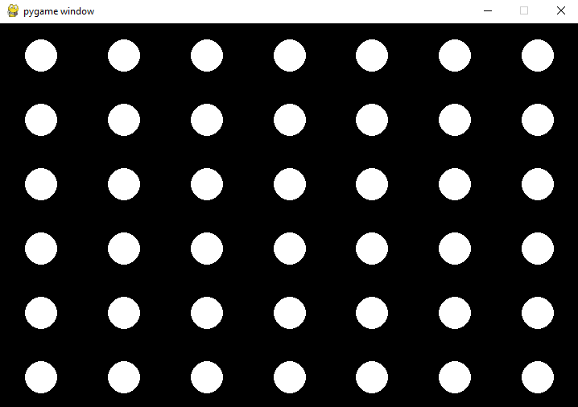
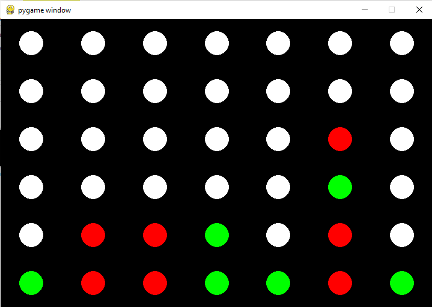
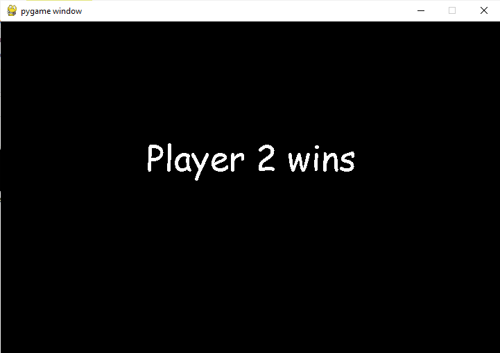

# ConnectX game

## How to install  

`pip install -r requirements.txt`  

## Run the game

`python main.py`

## Game description  

It's implementation of Connect X game

Initial board looks like this:  
  

  

End of the game:  
 

You can change `board size`, `number of players` and `X` value in main.py during initialization of the game. 
